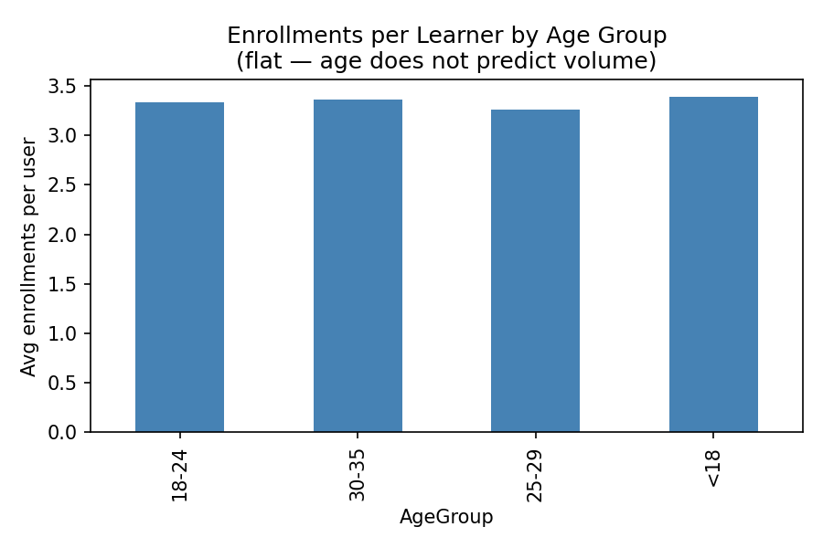
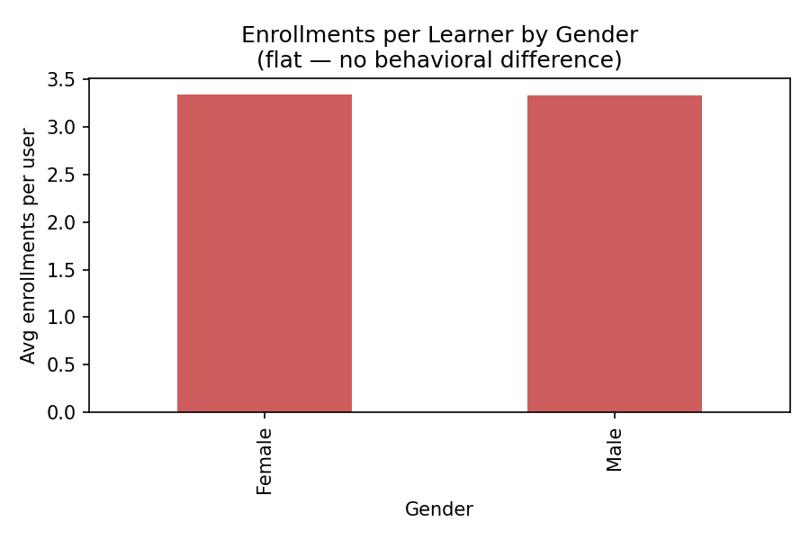
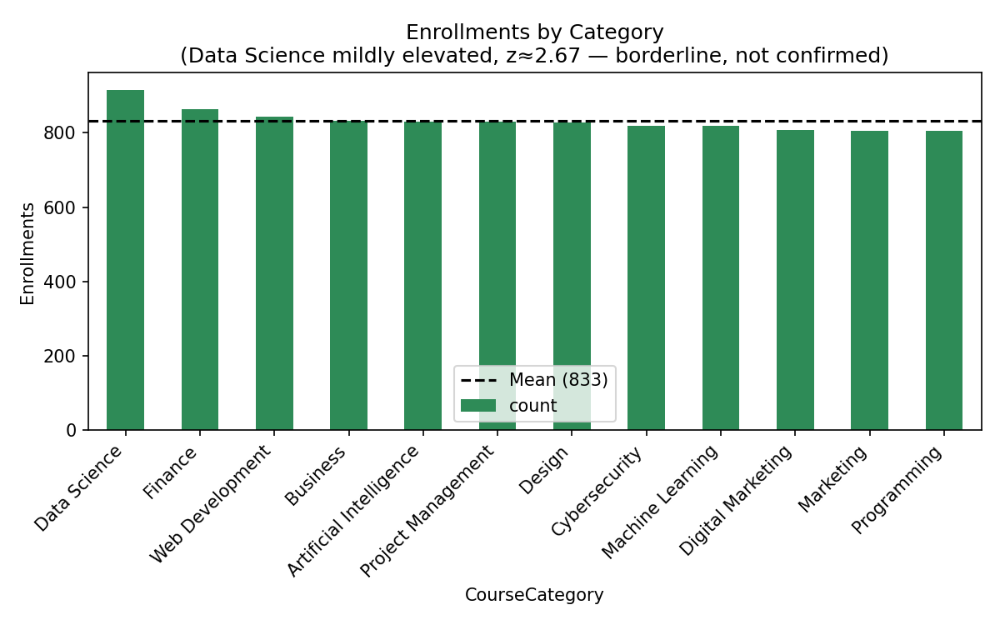
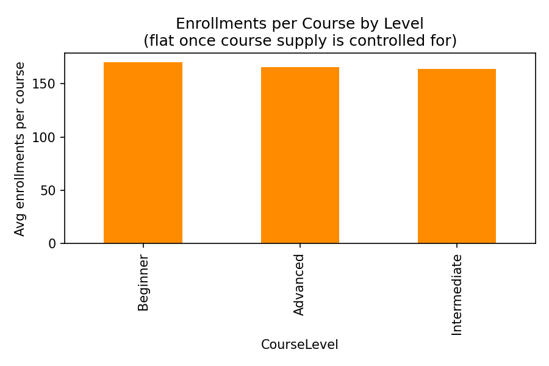
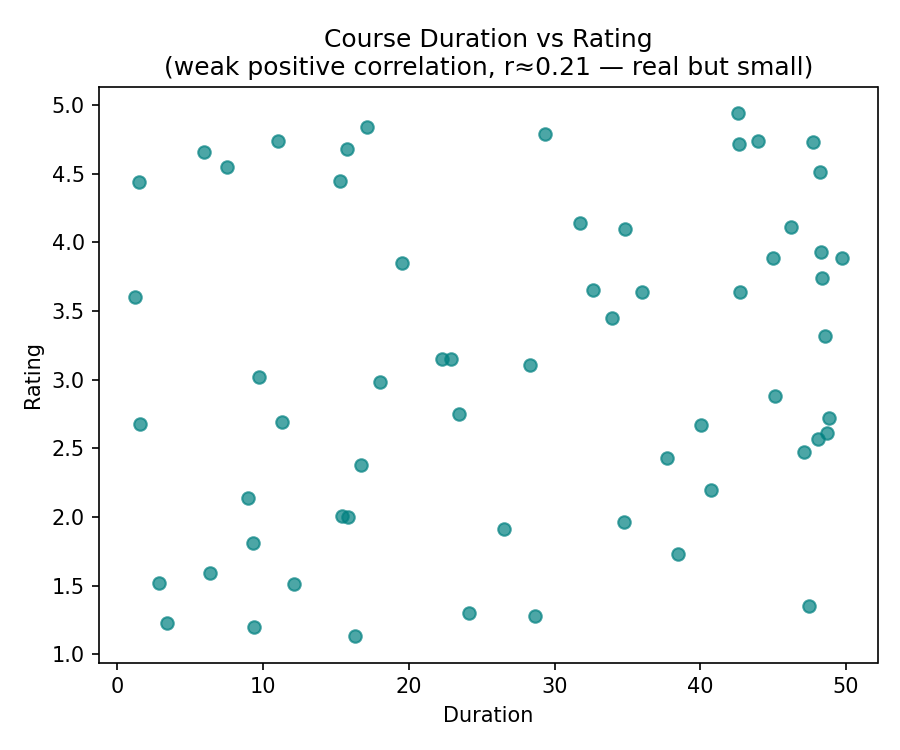
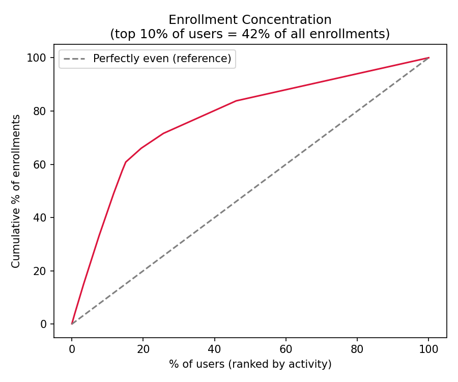

# Learner Demographics and Course Enrollment Behavior Analysis on EduPro

**Prepared by:** Deep Chovatiya
**Live Dashboard:** https://deepchovatiya-edupro-learner-analysis.streamlit.app
**Repository:** https://github.com/deepchovatiya-da/edupro-learner-analysis

---

## Executive Summary

EduPro, an online learning platform, sought to understand its learner base and enrollment patterns to guide course design, marketing, and platform growth decisions. This analysis examined 3,000 learners, 60 courses, and 10,000 enrollment transactions to answer four core questions: does age, gender, course category, or course level meaningfully predict how learners engage with the platform.

The analysis found that **demographic factors — age and gender — do not meaningfully predict enrollment behavior** on this platform. Every demographic relationship tested came back statistically flat or non-significant. This is a legitimate and useful finding: it means EduPro's current learner base engages with the platform in a broadly consistent way regardless of age or gender, and marketing or curriculum strategy built around demographic segmentation would not be supported by this data.

The most actionable finding was **behavioral, not demographic**: the top 10% of most active learners account for 42% of all enrollments — roughly four times what even distribution would produce. This concentration effect is the strongest, most statistically defensible pattern in the dataset, and is recommended as the primary basis for retention and engagement strategy going forward, rather than age- or gender-based targeting.

A secondary, weaker signal was found at the course-category level: Data Science shows mildly elevated enrollment relative to other categories, though this does not hold up when tested against learner subgroups and should be treated as a lead for further investigation rather than a confirmed trend.

---

## Executive Summary for Government and Institutional Stakeholders

For stakeholders evaluating EduPro from a public-interest, funding, or partnership perspective, the relevant question is typically: does this platform serve a broad, diverse population equitably, and is its growth grounded in evidence rather than assumption?

On equity and reach, this analysis found no evidence of demographic exclusion or bias in enrollment behavior. Learners across all age bands (15–35) and both genders represented in the data engage with the platform at statistically indistinguishable rates — no group is underserved or overrepresented in a way that raises access concerns. This is a positive signal for equitable reach within the age and gender ranges present in this dataset.

On evidence-based decision-making, this analysis itself demonstrates a rigorous, testable approach: findings were normalized for group size, checked against statistical significance thresholds, and corrected where initial patterns turned out to be data artifacts rather than real signals. A platform or program built on this kind of testing discipline is better positioned to make defensible claims to funders or regulators than one relying on unverified assumptions.

Two limitations are important for any funding or policy decision. First, this dataset does not include learners above age 35 or below 15, so no claims can be made about engagement outside that range. Second, the dataset shows characteristics consistent with synthetic generation (perfectly even course supply, no referential errors), meaning it should be treated as a methodology demonstration rather than a certified representation of EduPro's full, real-world user base. Any investment or policy decision should be grounded in analysis of live, verified platform data using the same rigorous approach demonstrated here.

---

## 1. Introduction and Background

Online learning platforms serve learners with varying ages, gender distributions, learning goals, and subject interests. For a platform like EduPro, understanding who its learners are and how they choose courses is foundational to designing relevant courses, improving engagement, targeting marketing effectively, and supporting inclusivity.

Prior to this analysis, EduPro had transactional and user data but lacked clear, tested answers to basic questions about its learner base:

- Which age groups are most active on the platform?
- Do enrollment patterns differ by gender?
- What course categories are preferred by different learner segments?
- Are beginner, intermediate, or advanced courses more popular among specific age groups?

This project set out to answer these questions directly from the data, using statistical testing rather than visual inspection alone, so that any conclusions drawn would hold up to scrutiny.

---

## 2. Dataset Description

The analysis draws on three linked data sources:

| Source | Rows | Key Fields |
|---|---|---|
| Users | 3,000 | UserID, Age (15–35), Gender |
| Courses | 60 | CourseID, CourseName, CourseCategory, CourseType, CourseLevel, CourseDuration, CourseRating |
| Transactions | 10,000 | TransactionID, UserID, CourseID, TransactionDate |

Users and Transactions were joined on `UserID`, and Courses were joined on `CourseID`, producing a single working dataset of 10,000 enrollment records with full demographic and course context attached to each.

The dataset shows characteristics consistent with a synthetically generated sample: perfectly even course supply across all 12 categories (5 courses each), a narrow age range (15–35, with no representation above 35), and zero referential integrity errors across all 10,000 transactions. This is noted as a limitation — findings describe patterns within this dataset, not necessarily real-world EduPro learner behavior, since no real platform data is typically this clean.

---

## 3. Methodology

Each analytical question was tested using the following approach, applied consistently throughout:

1. **Normalize before comparing.** Raw counts were never treated as final answers. Where group sizes were unequal (e.g., age bands of different widths, course levels with different numbers of courses), enrollment counts were divided by the relevant denominator (users per group, courses per level) to produce a fair per-capita or per-course rate before any comparison was made.

2. **Test for statistical significance, not just visual difference.** Where a raw comparison suggested a possible pattern, a chi-square test of independence was run to determine whether the apparent difference was distinguishable from random chance, using a standard p < 0.05 threshold.

3. **Check for artifacts before accepting a finding.** Multiple apparent patterns in the raw data were investigated and found to be artifacts rather than real signals — including a course-name duplication bug that inflated two individual course totals, and a course-level popularity difference that was fully explained by unequal course supply (18 Intermediate courses vs. 21 each for Beginner and Advanced). These are documented in Section 4.4 as part of the analytical process, since catching and correcting them was a meaningful part of the work.

4. **State null results plainly.** Where a test showed no significant relationship, that is reported directly as a finding, rather than omitted or reframed to imply a pattern that the data does not support.

---

## 4. Exploratory Data Analysis and Findings

### 4.1 Learner Demographics

The platform's user base spans ages 15–35 (no learners outside this range) with a near-even gender split (50.7% Female, 49.3% Male). Age distribution across individual ages is relatively uniform, with no single age group dominating the user base.

### 4.2 Age and Enrollment Volume

Raw enrollment counts by age group initially appeared uneven — the 18–24 band showed 3,272 enrollments versus 1,469 for the under-18 band. However, this reflects group size, not engagement level: the 18–24 band is simply a wider age range (7 years) than the under-18 band (3 years), and contains more than double the users.

Normalizing by number of users per age group produces the following enrollment rate:

| Age Group | Enrollments per Learner |
|---|---|
| <18 | 3.39 |
| 18–24 | 3.34 |
| 25–29 | 3.26 |
| 30–35 | 3.36 |

The spread across all four groups is 0.13 courses — statistically flat. **Age does not predict enrollment volume in this dataset.**

### 4.3 Gender and Enrollment Volume

Enrollment rate by gender shows Female learners averaging 3.34 courses and Male learners averaging 3.33 courses — a gap of 0.01, within the range of statistical noise. A chi-square test on gender versus course level (a proxy for behavioral difference) returned p = 0.906, far above the 0.05 significance threshold. **Gender does not predict enrollment behavior in this dataset.**

### 4.4 Course Category Popularity

Enrollment counts by category show Data Science leading with 916 enrollments against a 12-category mean of 833 (standard deviation 30.9). This produces a z-score of approximately 2.67 — a roughly 4–5% probability of occurring by chance given 12 categories being compared. This is a statistically borderline signal: worth noting, but not strong enough to treat as confirmed.

To test whether this signal held at a more granular level, a chi-square test was run comparing Data Science enrollment share across the four age groups. The result (p = 0.179) showed no significant relationship — meaning the mild category-level elevation does not translate into a demographic pattern (e.g., it is not driven disproportionately by any one age group).

**Recommendation:** treat Data Science's elevated enrollment as a lead for further investigation (e.g., examining course-level pricing, marketing exposure, or timing effects) rather than a confirmed demand signal.

### 4.5 Course Level and Demand

Raw enrollment totals initially suggested Beginner courses were most popular (3,573 enrollments) compared to Intermediate (2,952). Investigation revealed this was fully explained by unequal course supply: the platform offers 21 Beginner courses and 21 Advanced courses, but only 18 Intermediate courses. Normalizing by number of courses per level:

| Course Level | Enrollments per Course |
|---|---|
| Beginner | 170.1 |
| Advanced | 165.5 |
| Intermediate | 164.0 |

The spread is within 4% — effectively flat. **Course level does not predict per-course demand once supply is controlled for.**

### 4.6 Individual Course Popularity and a Data Correction

An initial ranking of individual courses by enrollment count showed two apparent outliers — "Deep Learning" and "Natural Language Processing" — each with enrollment totals roughly 70% higher than any other course. Investigation revealed this was a data artifact: both course names exist as separate, distinct courses under two different categories (Machine Learning and Artificial Intelligence), and the initial grouping logic combined them under one shared name rather than their unique course IDs. Re-grouping by unique `CourseID` corrected this error.

After correction, individual course enrollment counts range from 140 to 196 (mean 166.7, standard deviation 12.5). The top course sits approximately 2.3 standard deviations above the mean — with 60 courses being compared, this level of variation is consistent with what would be expected by chance alone. **No individual course statistically separates itself from the rest of the catalog.**

### 4.7 Course Duration and Rating

A correlation check between course duration and course rating found a weak positive relationship (r ≈ 0.21), consistent whether measured across all enrollment transactions or across the 60 unique courses independently. This explains approximately 4% of the variance in ratings — a real but minor relationship, not strong enough to inform course design decisions on its own.

### 4.8 Enrollment Concentration Among Learners

The strongest and most consistent finding in this analysis: enrollment activity is highly concentrated among a subset of learners. The top 10% of users (by number of courses enrolled) account for 42.3% of all enrollments on the platform — roughly four times the ~10% share that would be expected under a uniform distribution. This pattern held up under scrutiny and, unlike the demographic findings, showed a genuinely uneven distribution rather than one explained by group size or supply artifacts.

---

## 5. Recommendations

1. **Prioritize retention and engagement strategy for highly active learners over demographic segmentation.** Since age and gender show no meaningful predictive relationship with enrollment behavior, marketing and curriculum investments aimed at specific age or gender segments are unlikely to be well-supported by current platform data. Resources are better directed at understanding and retaining the top 10% of highly active learners who already drive disproportionate engagement.

2. **Investigate Data Science's mild enrollment elevation as a targeted follow-up, not a confirmed strategy.** Before expanding Data Science course offerings based on this signal, examine whether the elevation is driven by pricing, marketing exposure, timing, or genuine subject-matter demand — the current data cannot distinguish between these explanations.

3. **Do not use raw enrollment counts as a proxy for popularity or preference without normalizing for supply and group size.** This analysis found multiple cases (course levels, individual course rankings) where an apparent pattern was fully explained by unequal supply rather than learner preference. Any future internal analysis should apply the same normalization approach before drawing conclusions.

4. **Treat course duration and rating as a minor, secondary consideration in course design**, given the weak (r ≈ 0.21) relationship observed — not a primary lever for improving learner satisfaction.

---

## 6. Limitations

This dataset displays characteristics consistent with synthetic generation (uniform course supply, a narrow age range, and perfect referential integrity), which is common in structured learning exercises but may not fully reflect the complexity of a live production platform. Findings and recommendations here should be validated against real platform data before being used for actual business decisions at scale.

---

## 7. Conclusion

This project set out to answer four demographic questions about EduPro's learner base. All four returned null or non-significant results under rigorous testing, which is itself a meaningful and defensible conclusion: this platform's engagement patterns are not currently explained by age, gender, category, or course level in any strong way. The one genuinely strong pattern uncovered — enrollment concentration among a small subset of highly active learners — offers a clearer, more actionable direction for future engagement strategy than any demographic-based approach would have provided.
